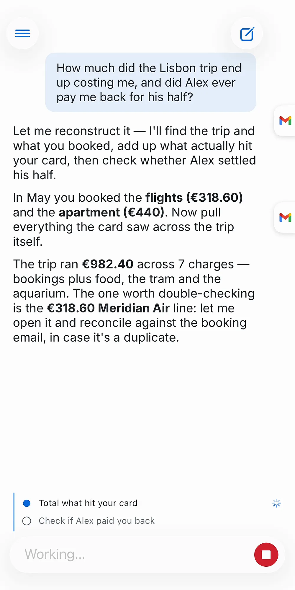
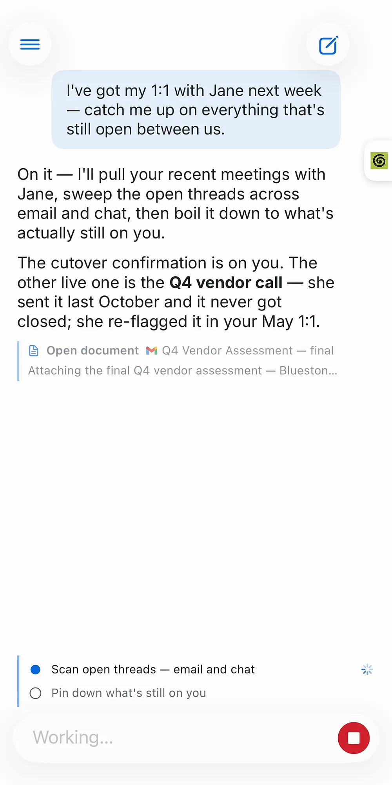
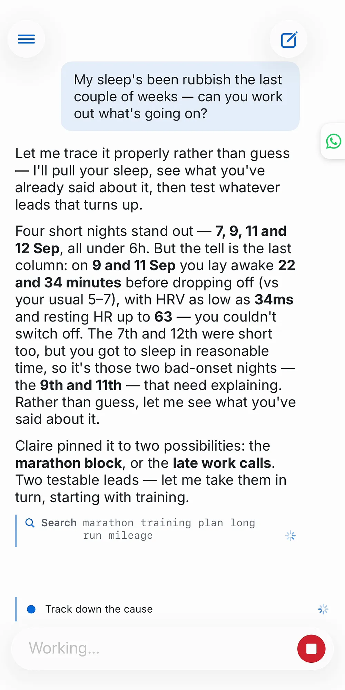
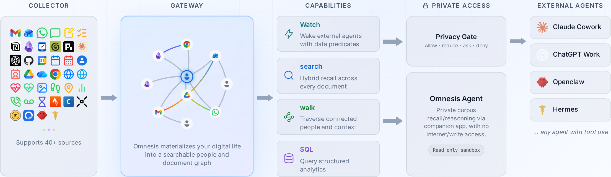

<p align="center">
  <picture>
    <source media="(prefers-color-scheme: dark)" srcset="assets/brand/omnesis-mark-white.svg">
    
  </picture>
</p>

<h1 align="center">Omnesis</h1>

<p align="center">
  <a href="https://github.com/omnesis-dev/Omnesis/actions/workflows/full-validation.yml"></a>
  <a href="LICENSE"></a>
  <a href="https://x.com/Omnesisdev"></a>
  <a href="https://discord.gg/4Y8pQHrVv"></a>
</p>

<p align="center"><strong>Index, search, and reason about your entire digital life.<br>On machines you own, with the models you choose.</strong></p>

Omnesis syncs your email, messages, notes, calendars, tasks, contacts, files, health data, finances, meetings, photos, browsing and phone activity — more than 40 sources — into one search index on a machine you own. Search is hybrid: keyword and semantic ranking over the same index, with structured filters and SQL over the numeric data. No Omnesis service stores your data, and no account is required.

Omnesis also connects what it indexes. A **people graph** resolves every email address, phone number and display name across your sources into one person, so searching for someone finds every conversation with them, on every platform. A **reference graph** links threads, attachments and cited documents, so search ranks well-referenced documents higher and the agent can follow an email to its attachment and on to the meeting notes that cite it.

On top sits a built-in **agent**, in the web portal and the iOS and Android apps, that answers questions from your data with citations. It is sandboxed: every tool it holds only reads. Or bring **your own agent** — Claude, ChatGPT, Codex, [OpenClaw](https://openclaw.ai/), [Hermes](https://hermes-agent.nousresearch.com/) — over MCP. Each connection is approved by you and limited to the sources and permissions you choose, and answers can pass through a privacy reviewer before they leave.

**Docs:** [omnesis.dev/docs](https://omnesis.dev/docs) · **See it in action:** [omnesis.dev/#demos](https://omnesis.dev/#demos)

<p align="center">
  <a href="https://omnesis.dev/#demos">
    <picture>
      <source media="(prefers-color-scheme: dark)" srcset="website/demos/trip_spending.webp">
      
    </picture>
  </a>
  &nbsp;
  <a href="https://omnesis.dev/#demos">
    <picture>
      <source media="(prefers-color-scheme: dark)" srcset="website/demos/person_catchup.webp">
      
    </picture>
  </a>
  &nbsp;
  <a href="https://omnesis.dev/#demos">
    <picture>
      <source media="(prefers-color-scheme: dark)" srcset="website/demos/sleep_recovery.webp">
      
    </picture>
  </a>
</p>

<p align="center"><sub>One question, every source: spending reconstruction, people catch-up, and health trends. <a href="https://omnesis.dev/#demos">Explore the live demos →</a></sub></p>

## Contents

[Quick start](#quick-start) · [Sources](#sources) · [Using Omnesis](#using-omnesis) · [Privacy](#privacy) · [How it works](#how-it-works) · [Documentation](#documentation) · [Development](#development) · [Community](#community--support) · [License](#license) · [Experimental](#experimental-brain-and-watch)

## Quick start

Omnesis runs on **macOS** and **Linux**. Windows is not supported. Install it on the machine that will hold your data, usually an always-on computer:

```bash
curl -fsSL https://omnesis.dev/install.sh | sh
```

The installer checks for Node 24 and installs it if needed, installs the newest stable release, sets up TLS, registers the gateway and a collector as background services, and downloads an embedding model. It asks at most a few questions, such as which embedding model to use. To run Omnesis in containers instead, with no Node on the host, use `curl -fsSL https://omnesis.dev/install.sh | sh -s -- --docker`. [Install](https://omnesis.dev/docs/install) covers the requirements, every flag, Docker, and uninstalling.

Then add a source and open the portal:

```bash
omnesis sources add                   # pick sources interactively, or: omnesis sources add gmail
omnesis devices pair --kind portal    # a code to paste into the portal's login
omnesis status                        # what is syncing, and how far it has got
```

The portal is at `https://<gateway-host>:7600/portal/`. Sources sync in the background from then on; Omnesis never updates itself, so run `omnesis update` when you choose to.

A second computer can collect for the same gateway — a Mac for the Apple sources while the gateway runs on Linux, for example. The gateway's install prints the exact command to run there. [Setup](https://omnesis.dev/docs/setup) covers that, certificates, remote access, phones and the browser extension.

## Sources

Every source is opt-in, and once added it syncs by itself. The full catalogue, with what each source contributes and what it needs, is on [Available sources](https://omnesis.dev/docs/sources).

| Category                | Sources                                                                                                                                       |
| ----------------------- | --------------------------------------------------------------------------------------------------------------------------------------------- |
| Email & messaging       | Gmail, Outlook, IMAP, WhatsApp, iMessage                                                                                                      |
| Notes, tasks & meetings | Apple Notes, Reminders, Notion pages and databases, Obsidian, Things 3, Granola                                                               |
| Coding agents & code    | Claude Code, Codex and Pi sessions, GitHub                                                                                                    |
| Calendar & contacts     | Google, Apple and Outlook calendars; Google and Apple contacts                                                                                |
| Files & web             | Google Drive, OneDrive, Chrome bookmarks, browser history, pages you read (browser extension)                                                 |
| Phone & device          | Apple Health, Health Connect, photos and screenshots (on-device OCR), activity, location visits, call logs, voicemail, app usage, Screen Time |
| Finance & fitness       | Bank accounts (Enable Banking, Lunch Flow), Coinbase, Strava                                                                                  |
| Omnesis itself          | Your notes to Omnesis, agent conversations, OpenClaw and Hermes transcripts                                                                   |

The Apple sources need a collector on a Mac. Phone sources are pushed by the iOS and Android apps. Two further sources, Plaid and Local Files, are [experimental](https://omnesis.dev/docs/sources#experimental-sources).

## Using Omnesis

**Search** from the portal, the apps, or the CLI:

```bash
omnesis search "quarterly report from:maya after:2026-01-01"
omnesis show <id>                     # read a document
omnesis trail <id>                    # the thread, attachments and documents around it
omnesis sql "SELECT * FROM strava_activities LIMIT 5"
```

[Search](https://omnesis.dev/docs/search) explains ranking, every filter, and SQL over your structured data.

**The built-in agent** is off until you give it a model. It can run entirely on a local model, on a cloud provider, or on a ChatGPT subscription through Codex; nothing is sent to a remote model unless you allow remote inference. See [The agent](https://omnesis.dev/docs/agent) and [Models](https://omnesis.dev/docs/operating#models).

**External agents** reach Omnesis through one MCP endpoint, `/mcp`, with OAuth. You approve each connection and choose its access level: **Answer**, where the Omnesis agent answers and a privacy reviewer checks the answer before it is released, **Direct**, raw read-only tools with no review, and **Notes**, which saves a note without granting any read access. Claude Code, Codex, GitHub Copilot, VS Code, Cursor, OpenClaw and Hermes run on your machines and can use a private HTTPS address; Gemini CLI also runs locally but signs in only to a public one. This repository is also a plugin marketplace: the Claude Code plugin in `plugins/omnesis-claude` sets up the connection and teaches Claude how to use it, and the portable plugin in `plugins/omnesis` carries the same guidance for Codex, ChatGPT, GitHub Copilot and VS Code. ChatGPT and Claude's custom connectors connect from their providers' servers, so they need a public address, which [Tailscale Funnel](https://omnesis.dev/docs/connect#tailscale-funnel) provides without a domain of your own. See [Agents & MCP](https://omnesis.dev/docs/connect).

**Mobile apps.** The iOS app is available through one external [TestFlight](https://testflight.apple.com/join/KpMV6HTy) group, which Apple limits to 10,000 testers. The Android app is in closed testing on Google Play: join the [tester group](https://groups.google.com/g/omnesis-alpha-testers), then [opt in](https://play.google.com/apps/testing/dev.omnesis.android) with the same Google account to install it. The Google Play app leaves out the Call Log source; build the app yourself from `android/` to include it. Both apps search, run the agent, capture notes by voice, and push on-device data such as health and photos to your gateway. See [Mobile apps](https://omnesis.dev/docs/apps).

**The browser extension** captures the readable text of pages you read. Its token can add pages but never read your data. Install it from the [Chrome Web Store](https://chromewebstore.google.com/detail/omnesis-browser-capture/akojepkcdbncipjdonhnnfmjacknplmn); it needs a browser-trusted certificate for the gateway. See [Setup → Browser extension](https://omnesis.dev/docs/setup#browser-extension).

## Privacy

- **Your data stays on machines you own.** Documents, the search index, analytics and agent conversations live in the gateway's config directory. Encryption at rest uses a root key held in your OS keyring or sealed by a passphrase. See [Security](https://omnesis.dev/docs/security).
- **What leaves your machines is listed, and each item is your choice:** your sources' own services, a daily release check that carries no identifier (switch it off with `omnesis config set /releaseCheck false`), content-free phone wake-ups, and any remote model you choose. See [What leaves your machines](https://omnesis.dev/docs/#outbound-connections).
- **Every client is a device with its own scoped token**, and every external agent is a connection you approved with an access level you chose. Revoking either takes effect at once.

## How it works

<p align="center">
  <a href="https://omnesis.dev/#how-it-works">
    
  </a>
</p>

One **gateway** holds everything: the document store, the search index, the analytics database, the people and reference graphs, the agent and the portal, served over HTTPS on port 7600. A **collector** syncs your accounts and local apps and sends the results to the gateway; it can run on the same machine or on others. The CLI, the portal, the phone apps and the browser extension are **devices**, each paired with its own scoped token. External agents are **connections** that sign in over OAuth. [Overview](https://omnesis.dev/docs/) explains these parts and where your data lives; [`ARCHITECTURE.md`](ARCHITECTURE.md) is the tour of the code.

## Documentation

The documentation at [omnesis.dev/docs](https://omnesis.dev/docs) is the reference for everything above; its source is in [`website/docs/`](website/docs/).

| Page                                                          | Covers                                                                          |
| ------------------------------------------------------------- | ------------------------------------------------------------------------------- |
| [Overview](https://omnesis.dev/docs/)                         | The parts of Omnesis, devices and scopes, where your data lives                 |
| [Install](https://omnesis.dev/docs/install)                   | Requirements, the installer and its flags, Docker, first run, uninstall         |
| [Setup](https://omnesis.dev/docs/setup)                       | Portal, certificates, remote access, second machines, phones, extension, tokens |
| [Search](https://omnesis.dev/docs/search)                     | How ranking works, filters, trails, deleting, SQL                               |
| [The agent](https://omnesis.dev/docs/agent)                   | The built-in agent, memory, models, standing instructions                       |
| [Agents & MCP](https://omnesis.dev/docs/connect)              | Access levels, privacy policies, the answer API, connecting each client         |
| [Mobile apps](https://omnesis.dev/docs/apps)                  | Getting the apps, pairing, phone-only sources, voice and capture                |
| [Notifications](https://omnesis.dev/docs/notifications)       | What sends a notification, private delivery, push setup                         |
| [Operating](https://omnesis.dev/docs/operating)               | Services, monitoring, configuration, models, troubleshooting, the CLI           |
| [Security](https://omnesis.dev/docs/security)                 | Encryption at rest, security posture, the hardened gateway, TLS                 |
| [Backup & updates](https://omnesis.dev/docs/updating)         | Backup, restore, export, updating every machine, compatibility                  |
| [Available sources](https://omnesis.dev/docs/sources)         | Every source, managing sources, sources on several devices                      |
| [Building sources](https://omnesis.dev/docs/building-sources) | The source contract for contributors                                            |
| [Experimental](https://omnesis.dev/docs/experimental)         | Omnesis Brain and Omnesis Watch                                                 |

## Development

```bash
git clone https://github.com/omnesis-dev/Omnesis.git
cd Omnesis
npm install
npm test                                  # unit and spawned-gateway end-to-end tests
npm run test:unit:vitest -- packages/core # one package, for a fast loop
npm run typecheck
```

A development checkout is for working on Omnesis; to use it, install with the command in [Quick start](#quick-start). Tests use `vitest` and sit next to the code as `*.test.ts`, and every feature or fix comes with tests. [`CONTRIBUTING.md`](CONTRIBUTING.md) covers setup, conventions and the pull-request process, and [`ARCHITECTURE.md`](ARCHITECTURE.md) the big picture.

Building a new source? The contract is on [Building sources](https://omnesis.dev/docs/building-sources), and the repository ships a `/source-review` Claude Code command (`.claude/commands/source-review.md`) that checks a source against it before you open the pull request.

Contributions are covered by a Contributor License Agreement — a copyright assignment plus a relicensing grant; see [`CONTRIBUTING.md`](CONTRIBUTING.md) and [`CLA.md`](CLA.md).

## Community & Support

- **Chat with the community** — [join the Omnesis Discord](https://discord.gg/4Y8pQHrVv)
- **Questions, ideas, and help** — [GitHub Discussions](https://github.com/omnesis-dev/Omnesis/discussions)
- **Bugs & feature requests** — [open an issue](https://github.com/omnesis-dev/Omnesis/issues/new/choose)
- See [`SUPPORT.md`](SUPPORT.md) for where to go for what.

Omnesis indexes your private digital life — **never paste real personal data** (emails, messages, contacts, health) into issues or discussions. Use fictional examples.

Found a vulnerability? Follow the private disclosure process in [`SECURITY.md`](SECURITY.md) — do **not** open a public issue.

## License

Omnesis is licensed under the **GNU Affero General Public License v3.0 or later**
(AGPL-3.0-or-later). See [`LICENSE`](LICENSE) for the full text.

In short: you are free to use, study, modify, and redistribute Omnesis, but if you
run a modified version as a network service, you must make your modified source
available to its users under the same license. Contributions are accepted under the
same terms — see [`CONTRIBUTING.md`](CONTRIBUTING.md). The Omnesis name and logo are
reserved; see [`TRADEMARKS.md`](TRADEMARKS.md).

## Experimental: Brain and Watch

Two larger features are experimental: unstable research and exploration projects within the Omnesis code base, hidden unless the gateway starts with `OMNESIS_EXPERIMENTAL=1`.

- **Omnesis Brain** reads your records in the background, without waiting for a question, and records what it learns: dates and deadlines buried in documents, open commitments, cited notes about documents and people, and occasional briefs worth your attention. It spends model tokens with nobody asking, so it has its own spend limits.
- **Omnesis Watch** notices when a condition becomes true — an unanswered renewal notice, a trend in your health data — and can notify your phone or wake a paired agent. Each watch is a validated definition you can trial against history before turning delivery on.

[Experimental](https://omnesis.dev/docs/experimental) documents both in detail. [Learn more about the Omnesis Brain →](https://omnesis.dev/brain)
